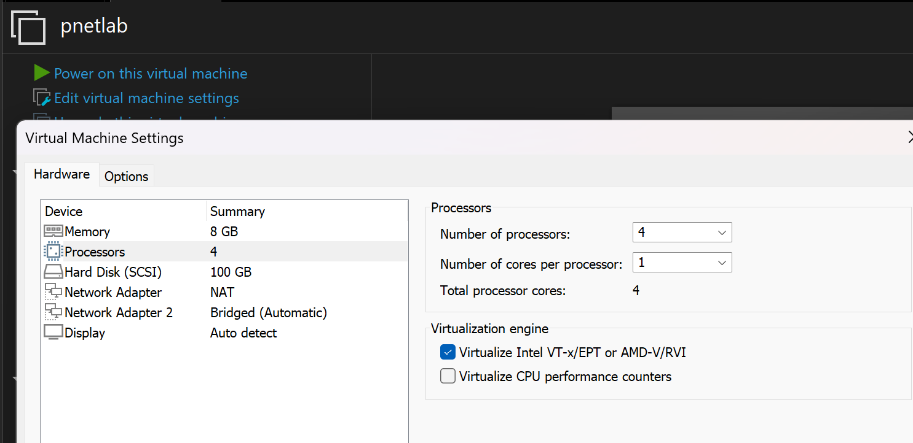
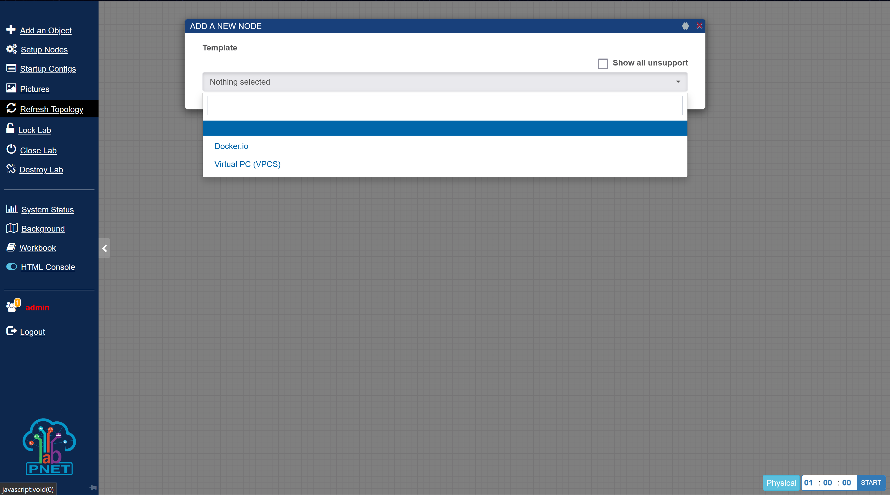

# Добавляем виртуальный маршрутизатор Eltex vESR в PnetLab

> [!NOTE]
> Данная инструкция написана в первую очередь для студентов МИРЭА, желающих выполнять практики по ОСТ-1/2 на своих рабочих лошадках.
> Инструкция подходит для таких же, как и я - не понимающих, что происходит вообще и с чем оно употребляется, иначе говоря, с ***НУЛЯ***.
> В инструкции я укажу все проблемы, с которыми я столкнулся, а также способы их решения.

>[!IMPORTANT]
>Вся проделанная работа выполнялась на Win 11 Pro, можно, конечно, попробовать сделать и на Home версии, но я не уверен, так как в бессчетных количествах попыток решения проблем, все сводилось к тому, что необходимо обновиться до Pro версии.

> p. s. Для меня это все в принципе в новизну, поэтому я не обещаю, что инструкция будет красивой и крутой, заранее благодарю за терпение и понимание. А вообще я мог бы и не делать никакой инструкции, так что имеем и ценим.

## Подготовка к установке VMWare Workstation Pro
>[!TIP]
>После каждого действия следует перезагружать свой компьютер, рекомендую.

>[!WARNING]
>Перед самым началом, необходимо убедиться, что наш процессор поддерживает виртуализацию, поэтому необходимо загуглить модель своего камня и проверить пукнт Virtualization. В случае, если процессор от Intel, можно скачать [Intel Proccessor Identification Utility](https://www.intel.com/content/www/us/en/download/12136/intel-processor-identification-utility-windows-version.html?wapkw=intel%20processor%20identification%20utility%20legacy) (На сайт переходить ***строго*** с включенным VPN).


- Заходим в БИОС и проверяем включенность всех флажков Virtualization во вкладке Security.

- Нажимаем "Пуск" и пишем msinfo/Сведения о системе, и листаем в самый низ. Нам нужны только параметр "Безопасность на основе виртуализации". 
	Если флаг стоит "Выполнение", значит ***нужно*** выключать его.

- Нажимаем "Пуск" и пишем "Дополнительные компоненты".

	- Листаем вниз до вкладки "Сопутствующие параметры", выбираем "Другие компоненты Windows". Необходимо убрать флажок в таких местах, как "Hyper-V", "Virtual Machine Platform" и "Платформа низкоуровневой оболочки Windows" и перезагружаем компьютер (насчет последнего я не уверен, но все же, я решил убрать. Напоминаю, что в данном деле я дилетант). 

- Нажимаем "Пуск" и пишем "Службы", здесь нам необходимо остановить все задачи, в которых есть ***хоть какое-то упоминание*** HYPER-V, а также "Служба узла HV", а также "HV Host Service".
	- Нажимаем "Пуск" и пишем "Редактор реестра". Здесь нам необходимо перейти по следующим реестрам и поставить им значение 0
```
Компьютер\HKEY_LOCAL_MACHINE\SYSTEM\CurrentControlSet\Control\DeviceGuard\EnableVirtualizationBasedSecurity
Компьютер\HKEY_LOCAL_MACHINE\SYSTEM\CurrentControlSet\Control\DeviceGuard\HyperVVirtualizationBasedSecurityOptout

Компьютер\HKEY_LOCAL_MACHINE\SYSTEM\CurrentControlSet\Control\DeviceGuard\Scenarios\HypervisorEnforcedCodeIntegrity\Enabled
```
>[!WARNING]
>Очень важно для тех, у кого ноутбук с наличием распознавания по лицу. Необходимо также присвоить значение 0 в следующей вкладке
>```Компьютер\HKEY_LOCAL_MACHINE\SYSTEM\CurrentControlSet\Control\DeviceGuard\Scenarios\WindowsHello\Enabled```

>[!NOTE]
>Я не уверен, но я также выключал в данной директории
>```Компьютер\HKEY_LOCAL_MACHINE\SYSTEM\CurrentControlSet\Control\Lsa```
>Здесь справа такие флажки, как **LsaCfgFlags** и **LsaCfgFlagsDefault**

- Нажимаем "Пуск" и пишем "gpedit.msc", там выбираем следующий путь
	```Конфигурация компьютера\Административные шаблоны\Система\Device Guard```
	Находим там "Включить средство обеспечения безопасности на основе виртуализации" и отключаем. 
- Для уверенности в завтрашнем дне запускаем powershell от имени администратора и прописываем следующую команду ```bcdedit /set hypervisorlaunchtype off``` .
- В завтрашнем дне мы все еще не уверены, поэтому снова нажимаем "Пуск" и пишем "Изоляция ядра". 
	- Здесь выключаем параметр "Целостность памяти". 
В теории, это все операции, которые я сделал, возможно что-то упустил, гарантий давать не могу, но этого должно быть достаточно для последующей установки VMWare Workstation.
## Установка VMWare Workstation Pro
>[!WARNING]
>После установки не рекомендуется удалять инсталлятор, он может еще пригодиться, если Безопасность на основе виртуализации так и не будет отключена.

По началу я пробовал делать все на "Oracle VirtualBox", но при запуске нода у меня просто крашнулась виртуальная машина, поэтому выбор в пользу VMWare Workstation.

> [!IMPORTANT]
> Данный блок предназначен для вообще начинающих и абсолютно не понимающих котят, если же интересует непосредственная загрузка образа, то **переход сюда**.

>[!TIP]
>Если что, можно скачать и со сторонних сайтов, типа 1progs.ru, но я не заставляю, в свое же оправдание скажу, что в моей инструкции все безопасно, честно.

-  Для начала, необходимо скачать платформу [VMWare Workstation Pro](https://www.vmware.com/products/desktop-hypervisor/workstation-and-fusion), она бесплатная, но я бы рекомендовал перед переходом на сайт, включить VPN.
- При нажатии на кнопку скачивания, нас перекидывает на сайт broadcom.com, где необходимо зарегистрироваться.

> [!TIP]
> Во время регистрации потребуется ввести регион и адрес. Я же ввел регион США и вставил рандомный адрес.

- После успешной регистрации нажимаем на лупу и в строке поиска появившегося нового окна пишем *VMWare Workstation pro*.
-  Нас интересует данная ссылка, переходим по ней.
- Нажимаем на необходимую ссылку.
- Выбираем VMWare Workstation Pro for Personal use (в большинстве случаев Windows) далее скачиваем и устанавливаем.

## Установка PnetLab

- Для начала переходим на [сайт Pnetlab](https://pnetlab.com/pages/download), пролистываем Step 1 и скачиваем PNET в формате .ova 
 >[!TIP]
>Лучше взять ссылку Mega, потому что в обычно Google Drive недоступен
- Далее открываем установленный VMWare WorkStation Pro, в левом верхнем углу нажимаем File - Open и выбираем PNET_4.2.10.ova
- Произвольно называем нашу виртуальную машину и импортируем ее.
- После импорта виртуальной машины, нажимаем в правом окне "Edit virtual machine settings", здесь ищем вкладку "Proccessors", нажимаем на нее и ***обязательно*** ставим галочку в пункте "***Virtualize Intel VT-x/EPT or AMD-V/RVI***", без нее мы не сможем запускать виртуальный маршрутизатор. 
- Теперь запускаем нашу виртуальную машину, она должна запуститься корректно без ошибок.
> [!WARNING]
> Если виртуальная машина со включенной галочкой не запускается, выдавая ошибку ***virtualized intel vt-x/ept is not supported on this platform***, значит не все параметры hyper-v в Win11 были выключены.
> В противном же случае, если не поставить данную галочку, то при запуске ВМ выйдет предупреждение. 
- ВМ запустилась корректно, на экране видим следующее: 
- Наши логин и пароль следующие: ***login: admin, password: pnet***.
>[!WARNING]
>Следует выключить такие обходы блокировок, как AmnesiaWG или любой другой VPN, за исключением gdpie/zapret
- После корректного ввода логина и пароля у нас появится синий экран, здесь пароль запишем ***pnet***, подтвердим его, остальные значения оставим по умолчанию, последовательно нажимая Enter.
- После у нас перезагрузится ВМ, введем заново логин и пароль root и pnet соответственно.
- На второй строке можем видеть локальный IP-адрес 192.168.109.130. Открываем браузер и вводим его. У нас появляется данная страница. Выбираем OFFLINE MODE. 
>[!NOTE]
>Бываем, что может вылезти всплывающее окно, что нельзя запустить оффлайн мод, пока не будет авторизации через онлайн мод, здесь ничего страшного нет, достаточно просто зарегистрироваться, используя свою почту.

- Вводим ниже ***login: admin, password: pnet,*** меняем ***Default console*** на ***HTML console*** и проходим простейшую капчу. 
- После успешного входа создаем новую лабу и произвольно ее называем, после нажимаем Add. 
- Открываем нашу лабу и попытаемся добавить объект. 
- Как можно увидеть, нам доступны только Docker.io и VPC. На данный момент можно считать, что установка платформы PnetLab прошла успешно, далее можно приступать к добавлению виртуального маршрутизатора Eltex. Виртуальную машину выключать пока не надо.

## Добавление виртуального маршрутизатора
 > [!NOTE]
 > Для дальнейшей работы потребуется программа MobaXterm, home-версию которой можно скачать бесплатно на [официальном сайте](https://mobaxterm.mobatek.net/download-home-edition.html)
- Виртуальный маршрутизатор необходимо запрашивать у вендора, но можно и в моем личном тгк: [*ужин с собакой*](t.me/dinnerwithdog)
 - Распакуем архив vesr в любой удобной директории и запускаем MobaXterm. 
 - В правом верхнем углу нажимаем кнопку Session - SSH. В строку Remote host записываем IP-адрес, который нам дала ВМ PnetLab. Ставим галочку слева от Specify name и вместо default пишем root. Готово. Нажимаем ОК. 
 - В всплывшем окне нажимаем Accept и в консоли вводим пароль pnet. При успешном входе увидим следующее. 
 - Далее свернем данную программу и перейдем обратно в VMWare WorkStation Pro. Здесь нам нужно будет создать новую виртуальную машину, используя образ виртуального маршрутизатора. Нажимаем в левом верхнем углу File - New Virtual Machine.
 - Здесь ничего не трогаем и нажимаем кнопку Далее. 
 - В следующем окне выбираем Installer disc image file (iso) и выбираем путь до нашего iso-образа vesr и нажимаем Далее.
 - Оставляем ОС Ubuntu (но наверное стоит поставить other linux), нажимаем Далее и произвольно называем нашу ВМ. 
 - В следующем разделе необходимо выбрать количество памяти. Ставим 1GB. 
 - Перед тем, как заканчивать, нам нужно избавиться от всех сетевых адаптеров. Нажимаем кнопку Customize hardware, в левом выбираем Network Adapter и снизу нажимаем Remove. После этого строка с сетевым адаптером должна исчезнуть.
 - Перед тем, как завершать установку, можно увидеть, что отсутствуют сетевые адаптеры. После чего установку можно завершить и запустить данную ВМ. 
 - Здесь можем ничего не трогать, либо же нажать Enter. Ничего не изменится. Установка все равно начнется. 
 - Выбираем vESR Installation.
 - Выбираем наш единственный диск, нажимая на Space, после Enter. 
 - Здесь нажимаем стрелку влево и Enter. 
 - После этого установка начнется и также быстро закончится, система потребует от нас перезапуска, поэтому пишем reboot, а после Enter. 